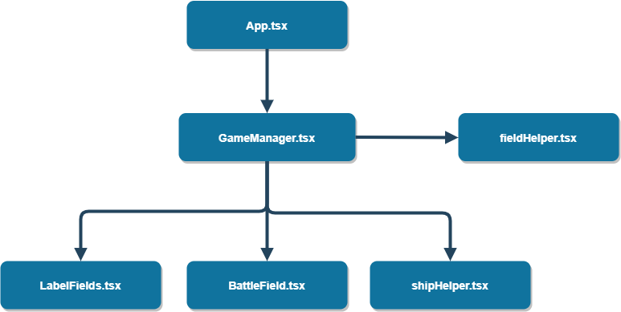

# Морской бой 

## Инструкция по запуску

В корневой директории необходимо выполнить:

`yarn start`

Эта команда запускает сайт в режиме разработчика.\
Откройте [http://localhost:3000](http://localhost:3000) для просмотра в браузере.

Страничка автоматически обновиться после изменения кодовой базы.\
Так же, в случае возникновения ошибки, в консоле вы увидите сводку.

Если вы хотите собрать продуктивную сборку, то выполните:  

`yarn build`

Собранный бандл вы сможете найти в папке `build`.

Продуктивная версия будет минифицированна и в бандлах будут использоваться хеши.
Далее вы можете разместить разместить на подготовленной среде либо в [docker](https://hub.docker.com/_/httpd) контейнере.

## Взаимосвязь компонентов

Скрипт | Описание
------------ | -------------
App.tsx | Определяет структуру сайта (header, body, footer)
GameMananger.tsx | Содержит в себе состояния кораблей, так же содержит в себе основную игровую логику.
LabelsFields.tsx | Является префабом. Используется для отрисовки горизонтальный и вертикальных отметок осей.
BattleField.tsx | Отрисовывает основные игровые элементы. Так же передает основные игровые события (клик по неотмеченной клетке и т.п.)
shipHelper.tsx | Содержит вспомогательные функции используемые для описания объектов BattleField.
fieldHelper.tsx | Содержит функции реализующие основные методы для для работы с BattleField (К примеру, проверка позиции, результат игры, расположением элементов при d&d)

## Алгоритм
